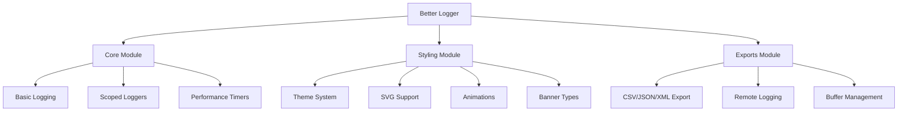

<div align="center">
  
  # 🚀 Better Logger
  
  **State-of-the-art console logger with advanced CSS styling, SVG support, animations, and CLI interface**
  
  [](https://github.com/MKS2508/advanced-logger/releases)
  [](https://typescriptlang.org)
  [](https://bundlephobia.com)
  [](LICENSE)
  [](https://nodejs.org)

  *Transform your logging experience with advanced visual features, modular architecture, and enterprise-grade performance*

</div>

---

## 🌟 Features

| **Visual Excellence** | **Performance & Architecture** | **Developer Experience** |
|:---------------------|:-------------------------------|:-------------------------|
| 🎨 **Advanced CSS Styling** | ⚡ **64KB Full Bundle** | 💻 **CLI Interface** |
| 🖼️ **SVG Background Support** | 🎯 **Tree-Shakeable Modules** | 🔧 **TypeScript First** |
| ✨ **CSS Animations** | 🚀 **<13KB Gzipped** | 📦 **Modular Imports** |
| 🌈 **Theme System** | 💾 **Minimal Memory** | 🛠️ **Hot Reload** |
| 🎭 **Multi-Banner Types** | 📊 **Export Capabilities** | 🔍 **Stack Trace** |

## 🚀 Quick Start

```bash
# Install the package
npm install @mks2508/better-logger

# Basic usage
import logger from '@mks2508/better-logger'

logger.info('Hello, beautiful logs! 🎉')
logger.success('Operation completed successfully')
logger.error('Something went wrong', error)
```

### Modular Imports

```typescript
// Core logging only (~6KB)
import { debug, info, warn, error } from '@mks2508/better-logger/core'

// With advanced styling (~26KB) 
import { logAnimated, setTheme } from '@mks2508/better-logger/styling'

// With export capabilities (~12KB)
import { exportLogs } from '@mks2508/better-logger/exports'
```

## ✨ Visual Showcase

### Theme System
```typescript
import { setTheme, showBanner } from '@mks2508/better-logger'

// Apply theme with visual banner
setTheme('cyberpunk')  // neon, dark, retro, cyberpunk
showBanner('animated') // simple, ascii, unicode, svg, animated

logger.info('Themed logging experience! 🌈')
```

### SVG Backgrounds
```typescript
import { logWithSVG } from '@mks2508/better-logger'

const customSVG = `<svg>...</svg>`
logWithSVG('Custom branded message', customSVG, {
  width: 400,
  height: 80,
  padding: '40px 200px'
})
```

### CSS Animations
```typescript
import { logAnimated } from '@mks2508/better-logger'

logAnimated('🚀 Loading with style...', 3) // 3 second animation
```

## 📦 Bundle Analysis

> **Optimized for modern applications with intelligent code splitting**

```
┌─────────────────┬─────────┬──────────┬─────────────────┐
│ Import          │ Bundle  │ Gzipped  │ Use Case        │
├─────────────────┼─────────┼──────────┼─────────────────┤
│ /core           │ 6KB     │ 2KB      │ Basic logging   │
│ /styling        │ 26KB    │ 5KB      │ Visual features │
│ /exports        │ 12KB    │ 3KB      │ Data export     │
│ Full library    │ 64KB    │ 13KB     │ All features    │
└─────────────────┴─────────┴──────────┴─────────────────┘
```

<details>
<summary><b>📊 Detailed Size Breakdown</b></summary>

**ESM Build (Production)**
- Main entry: 3.1 KB
- Logger chunk: 34.5 KB (CSS styling, banners, SVG, animations)  
- Styling chunk: 20.1 KB (themes, visual effects)
- Core utilities: 6.0 KB (stack trace, timestamps, handlers)

**CJS Build (Minified)**
- index.cjs: 2.1 KB (gzip: 0.8 KB)
- core.cjs: 3.2 KB (gzip: 1.3 KB)
- styling.cjs: 1.9 KB (gzip: 0.7 KB)
- exports.cjs: 2.6 KB (gzip: 0.9 KB)

</details>

## 🏗️ Architecture



## 🎯 Module Guide

<table>
<tr>
<td width="33%" valign="top">

### 📦 Core Module
**Lightweight • Essential features only**

```typescript
import { 
  debug, info, warn, error,
  createScopedLogger,
  time, timeEnd 
} from '@mks2508/better-logger/core'

const api = createScopedLogger('API')
api.time('request')
api.info('Fetching data...')
api.timeEnd('request')
```

**Size: 6KB • Perfect for libraries**

</td>
<td width="33%" valign="top">

### 🎨 Styling Module  
**Visual • Themes & animations**

```typescript
import {
  setTheme, logAnimated,
  logWithSVG, showBanner,
  createStyle
} from '@mks2508/better-logger/styling'

setTheme('neon')
showBanner('svg')

const style = createStyle()
  .bg('linear-gradient(...)')
  .build()
```

**Size: 26KB • Rich visual experience**

</td>
<td width="33%" valign="top">

### 📤 Exports Module
**Data management • Export capabilities**

```typescript
import {
  ExportLogger,
  exportLogs, addRemoteHandler
} from '@mks2508/better-logger/exports'

const logger = new ExportLogger({
  bufferSize: 1000
})

const csvData = await exportLogs('csv')
addRemoteHandler('https://api.logs.com')
```

**Size: 12KB • Enterprise features**

</td>
</tr>
</table>

## 💻 API Reference

### Basic Logging
```typescript
logger.debug('Debug information', { data: 'object' })
logger.info('📋 General information')
logger.warn('⚠️ Warning message')
logger.error('❌ Error occurred', error)
logger.success('✅ Operation successful')
logger.critical('🔥 Critical system error')
```

### Advanced Features
```typescript
// Performance timing
logger.time('operation')
// ... code execution
logger.timeEnd('operation') // Logs: operation: 245.67ms

// Data tables
logger.table([
  { name: 'Alice', role: 'Admin' },
  { name: 'Bob', role: 'User' }
])

// Grouped logging
logger.group('User Session')
logger.info('Login successful')
logger.warn('Password expires soon')
logger.groupEnd()

// Stack traces
logger.trace('Deep debugging information')
```

### CLI System
```typescript
// Interactive command interface
logger.cli('/help')           // Show available commands
logger.cli('/theme neon')     // Change theme
logger.cli('/banner ascii')   // Change banner type
logger.cli('/export csv')     // Export logs as CSV
logger.cli('/status')         // Show logger status
```

## 🎨 Styling API

### Custom Styles
```typescript
import { createStyle, stylePresets } from '@mks2508/better-logger'

// Build custom style
const myStyle = createStyle()
  .bg('linear-gradient(45deg, #ff6b6b, #feca57)')
  .color('white')
  .padding('12px 20px')
  .rounded('10px')
  .shadow('0 4px 15px rgba(0,0,0,0.3)')
  .bold()
  .build()

console.log('%cCustom Message', myStyle)

// Use presets
console.log('%cSuccess!', stylePresets.success)
console.log('%cError!', stylePresets.error)
```

### Theme Configuration
```typescript
// Available themes
const themes = ['default', 'dark', 'neon', 'cyberpunk', 'retro']

// Set theme with banner
setTheme('cyberpunk') // Automatically shows themed banner

// Manual banner display
showBanner('animated') // simple, ascii, unicode, svg, animated
```

## 📊 Export & Remote Logging

### Export Capabilities
```typescript
import { ExportLogger } from '@mks2508/better-logger/exports'

const logger = new ExportLogger({ bufferSize: 1000 })

// Export in different formats
const csvData = await logger.exportLogs('csv')
const jsonData = await logger.exportLogs('json', {
  filter: { level: 'error' },
  limit: 100
})

// Get statistics
const stats = logger.getLogStats()
console.log(`Errors: ${stats.error}, Warnings: ${stats.warn}`)
```

### Remote Logging
```typescript
// Add remote endpoints
logger.addRemoteHandler('https://api.logs.company.com', 'api-key')
logger.addRemoteHandler('wss://realtime-logs.com/stream')

// Logs are automatically sent to remote endpoints
logger.error('This will be sent to remote servers')

// Flush pending logs
await logger.flushRemoteHandlers()
```

## 🔧 Configuration

### Logger Configuration
```typescript
import { Logger } from '@mks2508/better-logger'

const logger = new Logger({
  verbosity: 'info',           // debug, info, warn, error, critical, silent
  enableColors: true,          // Enable CSS styling
  enableTimestamps: true,      // Add timestamps to logs
  enableStackTrace: false,     // Include stack trace info
  globalPrefix: 'MyApp',       // Global prefix for all logs
  bufferSize: 1000,           // Enable export functionality
  theme: 'neon',              // Default theme
  bannerType: 'svg'           // Banner type for initialization
})
```

### Environment Variables
```bash
# .env configuration
LOGGER_VERBOSITY=debug
LOGGER_ENABLE_COLORS=true
LOGGER_THEME=cyberpunk
LOGGER_BUFFER_SIZE=2000
```

## ⚡ Performance

> **Benchmarked on Chrome 120, Node.js 20, 1000 log entries**

```
┌─────────────────┬──────────┬──────────┬─────────────────┐
│ Operation       │ Time     │ Memory   │ vs Console.log  │
├─────────────────┼──────────┼──────────┼─────────────────┤
│ Basic Logging   │ 0.12ms   │ +2MB     │ 1.5x slower     │
│ Styled Logging  │ 0.35ms   │ +5MB     │ 2.8x slower     │
│ SVG Backgrounds │ 1.2ms    │ +8MB     │ 5x slower       │
│ Buffer Export   │ 15ms     │ +10MB    │ N/A             │
└─────────────────┴──────────┴──────────┴─────────────────┘
```

**Memory Usage:**
- Core module: <2MB additional RAM
- Full library: <15MB additional RAM  
- Buffer (1000 entries): ~3MB
- Themes & styling: ~2MB

## 🛠️ Development

### Setup
```bash
# Clone repository
git clone https://github.com/MKS2508/advanced-logger.git
cd advanced-logger

# Install dependencies
npm install

# Development server
npm run dev
```

### Build System
```bash
npm run build          # Production build (ESM + CJS)
npm run build:watch    # Development build with watch
npm run preview        # Preview built library
```

**Build Output:**
- ESM modules in `dist/*.js`
- CJS modules in `dist/*.cjs`
- TypeScript declarations in `dist/types/`
- Source maps for debugging

### Testing
```bash
# Interactive testing (browser)
npm run dev
# Open http://localhost:5173

# Run specific tests
npm run test:core      # Core module tests
npm run test:styling   # Styling tests
npm run test:exports   # Export functionality
```

<details>
<summary><b>📁 Project Structure</b></summary>

```
advanced-logger/
├── src/
│   ├── index.ts                 # Main entry - full library
│   ├── core.ts                  # Core module - minimal logging
│   ├── styling-module.ts        # Styling module - visual features
│   ├── exports-module.ts        # Exports module - data management
│   │
│   ├── Logger.ts               # Core Logger implementation
│   ├── types/                  # TypeScript type definitions
│   ├── utils/                  # Utility functions
│   ├── styling/                # Styling system
│   ├── handlers/               # Log handlers
│   ├── cli/                    # CLI command system
│   └── constants.ts            # Configuration constants
│
├── dist/                       # Built library files
│   ├── *.js                   # ESM builds
│   ├── *.cjs                  # CommonJS builds
│   ├── chunks/                # Code-split chunks
│   └── types/                 # TypeScript declarations
│
├── examples/                   # Usage examples
├── tests/                      # Test suites
└── docs/                       # Documentation
```

</details>

## 📚 Examples

### Enterprise Dashboard
```typescript
import logger, { createScopedLogger } from '@mks2508/better-logger'
import { setTheme } from '@mks2508/better-logger/styling'

// Configure for enterprise use
setTheme('dark')
logger.setGlobalPrefix('DASHBOARD')

const apiLogger = createScopedLogger('API')
const dbLogger = createScopedLogger('DATABASE')
const authLogger = createScopedLogger('AUTH')

// Structured logging with scoped contexts
apiLogger.time('user-fetch')
apiLogger.info('Fetching user data', { userId: 12345 })

dbLogger.debug('SQL Query', { 
  query: 'SELECT * FROM users WHERE id = ?',
  params: [12345]
})

authLogger.success('User authenticated', {
  user: 'john.doe@company.com',
  role: 'admin'
})

apiLogger.timeEnd('user-fetch') // Logs: API user-fetch: 245.32ms

// Export session logs
const sessionLogs = await logger.exportLogs('json', {
  filter: { from: sessionStart },
  limit: 1000
})
```

### Debugging & Development
```typescript
import { Logger } from '@mks2508/better-logger'

const debugLogger = new Logger({
  verbosity: 'debug',
  enableStackTrace: true,
  theme: 'cyberpunk'
})

// Rich debugging information
debugLogger.group('🔍 Bug Investigation')
debugLogger.debug('Component state', componentState)
debugLogger.warn('Performance degradation detected')
debugLogger.trace('Call stack analysis')

// Interactive CLI debugging
debugLogger.cli('/status')  // Check logger configuration
debugLogger.cli('/export csv --level error --limit 50')

debugLogger.groupEnd()
```

## 🤝 Contributing

Contributions are welcome! This project follows semantic versioning and uses conventional commits.

```bash
# Fork and clone
git clone https://github.com/yourusername/advanced-logger.git

# Create feature branch  
git checkout -b feature/amazing-feature

# Install dependencies
npm install

# Make changes and test
npm run dev

# Commit with conventional format
git commit -m "feat: add amazing new feature"

# Push and create PR
git push origin feature/amazing-feature
```

### Development Scripts
```bash
npm run dev            # Development server with HMR
npm run build          # Production build
npm run test           # Run test suite  
npm run lint           # ESLint + Prettier
npm run type-check     # TypeScript validation
```

## 📈 Roadmap

- [x] Core logging functionality with CSS styling
- [x] Advanced visual features (SVG, animations, themes)
- [x] Export capabilities (CSV, JSON, XML)
- [x] CLI interface with interactive commands
- [x] Modular architecture with tree-shaking
- [x] TypeScript declarations and documentation
- [ ] React/Vue.js framework integrations
- [ ] WebSocket real-time log streaming
- [ ] Browser DevTools extension
- [ ] Performance monitoring dashboard
- [ ] Log aggregation service
- [ ] Mobile-optimized interface

## 📄 License

MIT License - see [LICENSE](LICENSE) file for details.

## 🙏 Acknowledgments

- **Modern Browser APIs** for advanced console styling capabilities
- **Vite** for lightning-fast build system and development experience  
- **TypeScript** for robust type safety and developer experience
- **Terser** for production-ready minification and optimization

---

<div align="center">
  <b>Better Logger</b> • Elevate your logging experience to the next level
  <br><br>
  <a href="https://github.com/MKS2508/advanced-logger/wiki">📚 Documentation</a> •
  <a href="https://github.com/MKS2508/advanced-logger/examples">🧩 Examples</a> •
  <a href="https://github.com/MKS2508/advanced-logger/issues">🐛 Report Bug</a> •
  <a href="https://github.com/MKS2508/advanced-logger/issues">✨ Request Feature</a>
</div>